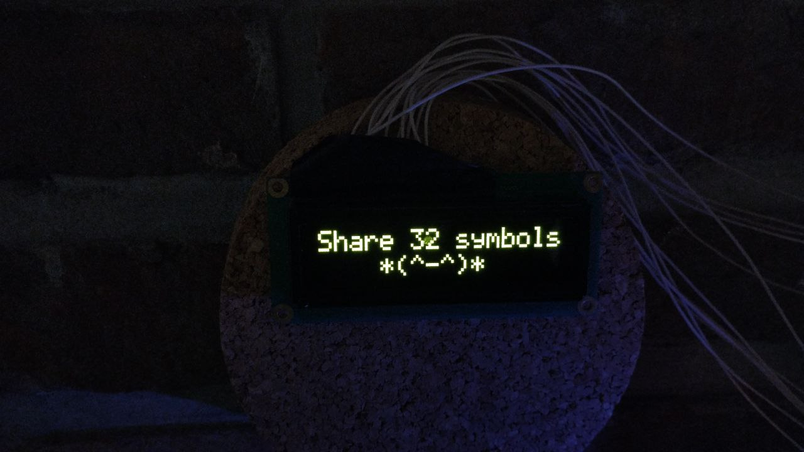

# Bring your 32 symbols out to my OLED display

This code parse donate messages from Donation Alert service
and print your donate message to my OLED display

## Stream links:
[Twitch](https://www.twitch.tv/anisyanka)(finished) 
[YouTube](https://www.youtube.com/watch?v=-ekq3e7EAH8&ab_channel=anisyanka)(already finished)

## How it looks like:
https://www.youtube.com/watch?v=U2oHjBrhQ44&ab_channel=anisyanka 

